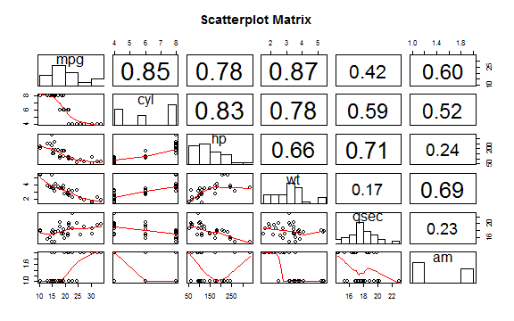
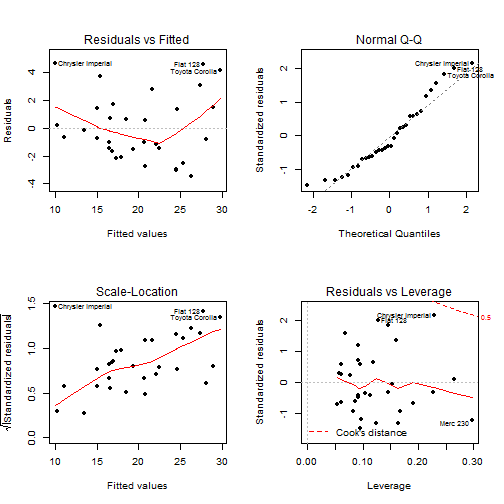

**Executive Summary**

We use the mtcars dataset available in R to explore the relationship between various features of 32 different automobiles and miles per gallon (MPG). We are particularly interested in the impact of manual and automatic transmission types on MPG. In our tests, we've found that in some cars a manual transmission can improve gas mileage compared with an automatic.

**Load and parse the data with the following code:**


```r
library(datasets); data(mtcars)
mtcars$am <- factor(mtcars$am, levels=0:1, labels=c("Automatic", "Manual")) #create factors with value labels
```

**Exploratory data analysis**

Before fitting our regression model we want to investigate how the variables are related to one another. We will use just some of the predictor variables that seem more important, like number of cylinders (cyl), horsepower (hp), weight (lb/1000), 1/4 mile time (qsec) and transmission type (am).
 

We draw several conclusions from above graph:

* There is fairly strong negative linear relationship between fuel efficiency (mpg) and weight (wt). Manual transmission cars tend to have lower weights and be more fuel efficient. 
* There is an inverse relationship between horsepower (hp) and mpg.
It seems that the cars with the highest hp tend to be manual.
* Cars with more cylinders (cyl) tend to have higher weight and lower fuel efficiency.

**Is an automatic or manual transmission better for MPG**

Next we consider whether the average mpg of automatic cars is different from manual. The gas mileage for manual and automatic transmissions are two independent data populations. We can model the response variable `mtcars$mpg` by the predictor `mtcars$am`, and then apply the `t.test` function to estimate the difference of the population means.

```r
t.test(mpg ~ am, data=mtcars) 
```

```
## 
## 	Welch Two Sample t-test
## 
## data:  mpg by am
## t = -3.767, df = 18.33, p-value = 0.001374
## alternative hypothesis: true difference in means is not equal to 0
## 95 percent confidence interval:
##  -11.28  -3.21
## sample estimates:
## mean in group Automatic    mean in group Manual 
##                   17.15                   24.39
```
The mean mileage of automatic transmission is 17.1 mpg and the manual transmission is 24.3 mpg. The 95% confidence interval of the difference in mean gas mileage is between 3.2 and 11.2 mpg. **MPG appears to be higher for manual transmission**.

**Quantify the MPG difference between automatic and manual transmissions**

We build a regression model using the backwards stepwise procedure. We start with a model that includes all the predictors. We call that the full model.  We want to eliminate the insignificant variables, so we use step to incrementally eliminate the underperformers. The result is called the reduced model:

```r
full.model <- lm(mpg ~ .,data=mtcars)
reduced.model <- step(full.model, direction="backward")
```
The summary (Figure 2) of the reduced model shows that it contains only significant predictors:

```r
summary(reduced.model)
```
From the above model details (Figure 2), we observe that the adjusted R2 value is 0.85 which is the maximum obtained considering all combinations of variables. Thus, we can conclude that more than 85% of the variability is explained by the above model.
F-statistics is higher than 1, and p-value very low (i.e. < 0.05), which means that there is some (linear) correlation between the predictor variables and the response. A manual transmission vehicle should expect to get 2.93 better `mpg` at the same level of `wt` and `qsec`. The correct coefficient could vary, in average, by 1.41 from the starting value of 2.93. Each increase of 1000lb of weight would expect to decrease the mpg experienced by 3.91 miles. Each additional second the car takes to run ¼ mile (`qsec`), would increase the mpg by 1.22 miles.

**Residuals and Diagnostics**

In this section, we shall study the residual plots of our regression model and also try to find out some leverage points in the data set. As you can see in Figure 3 there are outliers in certain locations that may influence our beta parameters. The "Residuals vs Fitted" and "Scale-Location" charts show that there is a trend to the residuals. The Normal Q-Q Plot shows that the residuals for some observations (Toyota Corolla, Chrysler Imperial, Fiat 128) don't follow the Normal Distribution.

```r
leverage <- hatvalues(reduced.model)
tail(sort(leverage),3)
```

```
##   Chrysler Imperial Lincoln Continental            Merc 230 
##              0.2296              0.2642              0.2970
```
We can measure the influence that an observation has on its fitted value with DFFITS.Theseare calculated by deleting an observation, refitting the model,recalculating the fit,

```r
dff <- abs(dffits(reduced.model))
dff[which(dff>1)]
```

```
## Chrysler Imperial 
##             1.268
```
Chrysler Imperialis the only car whose DFFIT exceeds one in absolute value

**Interaction terms**

Adding interaction terms to a regression model can greatly expand understanding of the relationships among the variables in the model and allows more hypotheses to be tested. The regression equation looks like this:

```r
model.interaction<-lm(mpg ~ wt + qsec + am + wt*am,data=mtcars)
summary(model.interaction)
```
The presence of a significant interaction (  p<0.05 - see  figure 4) indicates that the effect of `am` on `mpg` is different at different values of `wt`. Interpreting `am` is now more difficult. Since `wt` and `qsec` are continuous variables one way to get an understanding of the effect of `am` is to plug a few values of `wt` and `qsec` into the equation to see how `mpg`, changes.

```r
qsec.val<-c(rep(mean(mtcars$qsec),8));wt.val<-c(seq(2,5,by=1),seq(2,5,by=1))
am.val<-as.factor(c(rep("Manual",4),rep("Automatic",4)));df<-data.frame(wt=wt.val,qsec=qsec.val,am=am.val)
predict(model.interaction,df) 
```

```
##      1      2      3      4      5      6      7      8 
## 27.798 20.720 13.643  6.565 22.002 19.065 16.129 13.192
```
Summarizing the above results, we can observe that cars with a manual transmission and weight (lbs/1000) 2 and 3 have a lower fuel consumption when compared to cars with an automatic transmission. The opposite is true for cars weighing 4 and 5. 
e.g. For a car weighing 2 half tons the MPG difference between manual and automatic is +5.7 (27.7-22.0). For a car weighing 4 half tons the MPG difference between manual and automatic is -6.6 (6.5 - 13.1). 

**Conclusion**
Our analysis shows that cars with a manual transmission tend to be more fuel efficient on average. There is an amount of uncertainty in this conclusion given that weight is a very important predictor. Automatic transmission vehicles tend to be heavier and therefore provide worse fuel consumption.

**APPENDIX**

**Code for Figure 1 Scatterplot Matrix**


```r
#Scatter plot with correlations in the upper triangle, smoothing lines in the lower triangle, and histograms on the diagonal
panel.cor <- function(x, y, digits = 2, prefix = "", cex.cor, ...){ usr <- par("usr");
  on.exit(par(usr));par(usr = c(0, 1, 0, 1));r <- abs(cor(x, y, use ="complete.obs"));
  txt <- format(c(r, 0.123456789),digits = digits)[1];txt <- paste(prefix, txt, sep = "")
  if(missing(cex.cor)){cex.cor<-0.8/strwidth(txt)};text(0.5,0.5,txt,cex=cex.cor*(1 + r)/2)}
panel.hist <- function(x, ...) {
  usr <- par("usr"); on.exit(par(usr));par(usr = c(usr[1:2], 0, 1.5));
  h <- hist(x, plot = FALSE); breaks <- h$breaks; nB <- length(breaks);
  y <- h$counts;y <- y/max(y);rect(breaks[-nB], 0, breaks[-1], y, col = "white", ...)}
pairs(~mpg+cyl+hp+wt+qsec+am,data=mtcars, upper.panel = panel.cor, diag.panel = panel.hist, 
      lower.panel = panel.smooth,main="Scatterplot Matrix")
```

**Figure 2 Regression summary - reduced model**


```r
summary(reduced.model)
```

```
## 
## Call:
## lm(formula = mpg ~ wt + qsec + am, data = mtcars)
## 
## Residuals:
##    Min     1Q Median     3Q    Max 
## -3.481 -1.556 -0.726  1.411  4.661 
## 
## Coefficients:
##             Estimate Std. Error t value Pr(>|t|)    
## (Intercept)    9.618      6.960    1.38  0.17792    
## wt            -3.917      0.711   -5.51    7e-06 ***
## qsec           1.226      0.289    4.25  0.00022 ***
## amManual       2.936      1.411    2.08  0.04672 *  
## ---
## Signif. codes:  0 '***' 0.001 '**' 0.01 '*' 0.05 '.' 0.1 ' ' 1
## 
## Residual standard error: 2.46 on 28 degrees of freedom
## Multiple R-squared:  0.85,	Adjusted R-squared:  0.834 
## F-statistic: 52.7 on 3 and 28 DF,  p-value: 1.21e-11
```

**Figure 3 Residual plots**

 

**Figure 4 Regression summary - with interaction**


```r
model.interaction<-lm(mpg ~ wt + qsec + am + wt*am,data=mtcars)
summary(model.interaction)
```

```
## 
## Call:
## lm(formula = mpg ~ wt + qsec + am + wt * am, data = mtcars)
## 
## Residuals:
##    Min     1Q Median     3Q    Max 
## -3.508 -1.380 -0.559  1.063  4.368 
## 
## Coefficients:
##             Estimate Std. Error t value Pr(>|t|)    
## (Intercept)    9.723      5.899    1.65  0.11089    
## wt            -2.937      0.666   -4.41  0.00015 ***
## qsec           1.017      0.252    4.04  0.00040 ***
## amManual      14.079      3.435    4.10  0.00034 ***
## wt:amManual   -4.141      1.197   -3.46  0.00181 ** 
## ---
## Signif. codes:  0 '***' 0.001 '**' 0.01 '*' 0.05 '.' 0.1 ' ' 1
## 
## Residual standard error: 2.08 on 27 degrees of freedom
## Multiple R-squared:  0.896,	Adjusted R-squared:  0.88 
## F-statistic: 58.1 on 4 and 27 DF,  p-value: 7.17e-13
```
